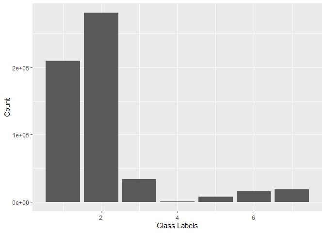

The Forest CoverType Dataset
================

-   [Motivation](#motivation)
-   [Data Description](#data-description)
-   [Original Results](#original-results)
-   [Train/Test Split](#traintest-split)
-   [Sources](#sources)

## Motivation

This repository was inspired by the tabular playground series [Kaggle
competition](https://www.kaggle.com/c/tabular-playground-series-dec-2021),
part of a competition series involving synthetic data generated from a
real dataset. For this particular competition, they revealed the
original dataset and did not anonymize the features. I thought it would
be interesting to try the same techniques on the original data as well
as the synthetic competition data. However, due to fundamental
differences in the synthetic data this wouldn’t always work. In the end,
I thought it would be better to keep my work on both datasets separated.

## Data Description

The full dataset consists of 581,021 observations with 12 attributes,
corresponding to 54 columns:

-   10 quantitative variables
-   wilderness area (one-hot encoded into 4 binary columns)
-   soil type (one-hot encoded into 40 binary columns)

Given below is the variable name, attribute type, the measurement unit
and a brief description, taken from the original data description:

    Name                                     Data Type    Measurement                       Description

    Elevation                               quantitative    meters                       Elevation in meters
    Aspect                                  quantitative    azimuth                      Aspect in degrees azimuth
    Slope                                   quantitative    degrees                      Slope in degrees
    Horizontal_Distance_To_Hydrology        quantitative    meters                       Horz Dist to nearest surface water features
    Vertical_Distance_To_Hydrology          quantitative    meters                       Vert Dist to nearest surface water features
    Horizontal_Distance_To_Roadways         quantitative    meters                       Horz Dist to nearest roadway
    Hillshade_9am                           quantitative    0 to 255 index               Hillshade index at 9am, summer solstice
    Hillshade_Noon                          quantitative    0 to 255 index               Hillshade index at noon, summer soltice
    Hillshade_3pm                           quantitative    0 to 255 index               Hillshade index at 3pm, summer solstice
    Horizontal_Distance_To_Fire_Points      quantitative    meters                       Horz Dist to nearest wildfire ignition points
    Wilderness_Area (4 binary columns)      qualitative     0 (absence) or 1 (presence)  Wilderness area designation
    Soil_Type (40 binary columns)           qualitative     0 (absence) or 1 (presence)  Soil Type designation
    Cover_Type (7 types)                    integer         1 to 7                       Forest Cover Type designation

## Original Results

From the [original data
description](https://archive.ics.uci.edu/ml/machine-learning-databases/covtype/covtype.info),
the goal of the research was to evaluate “classification accuracies when
predicting forest cover types in undisturbed forests”. To this end they
compared two different classes of predictive models, namely Linear
Discriminant Analysis and a feedforward neural network model which
achieved the following accuracies:

        -- 70% Neural Network (backpropagation)
        -- 58% Linear Discriminant Analysis
        

In this repository, we will try to improve on these results using
feature engineering and more modern ML libraries, but otherwise using
the same training and validation sets.

As a side experiment, we will also test models using cross-validation
with the same class imbalance as the full dataset.

## Train/Test Split

The original experimental setting had the following train/valid/test
split:

        -- first 11,340 records used for training data subset
        -- next 3,780 records used for validation data subset
        -- last 565,892 records used for testing data subset

We note that the training and validation sets are significantly smaller
than the test set. Furthermore, the training and validation sets have
completely balanced class labels with 1620 and 540 observations for each
class, respectively. The test set on the other hand is very imbalanced:

``` r
# Test Data
temp <- data %>% slice(15121:n())
qplot(temp$Cover_Type, geom = 'bar', ylab = 'Count', xlab = 'Class Labels')
```



## Sources

The dataset considered in this repository comes from the UCI ML
repository and was featured in the Forest Cover Type competition on
Kaggle. To see the original data sources, please check the following
links:

-   The Original Data
    ([source](https://archive.ics.uci.edu/ml/datasets/covertype))
-   The Original Data Description
    ([source](https://archive.ics.uci.edu/ml/machine-learning-databases/covtype/covtype.info))
-   Forest Cover Type Competition
    ([link](https://www.kaggle.com/c/forest-cover-type-prediction))
-   Tabular Playground Series December 2021
    ([link](https://www.kaggle.com/c/tabular-playground-series-dec-2021))
